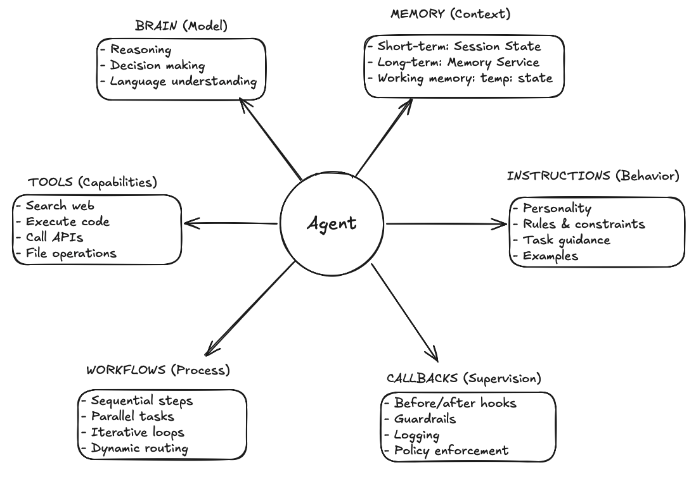
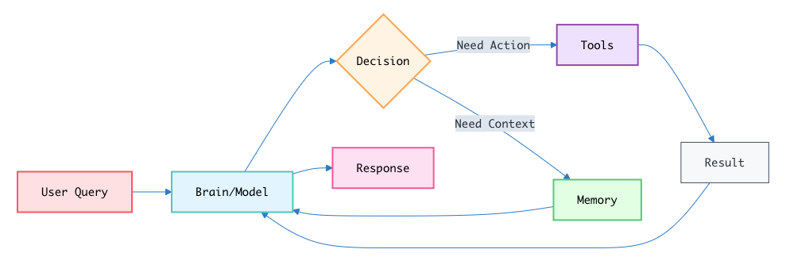

# AI Agent
An AI agent is a smart software program that can think, plan, and take action on its own to achieve a goal.

**Example**

Prompt: You tell the agent, "I need a new outfit for a winter party in London."

1. **Think**: Understanding the situation and reasoning about options
* Interpret: “new outfit” + “winter” + “party” + “London.”
* Infer constraints: party-appropriate, warm layers, delivery before event.
* Recall prefs: sizes, brands, style, budget.

2. **Plan**: Turning the reasoning into an ordered, goal-directed strategy
* Break down the task: The agent interprets your request and plans its course of action.
  * Subtask 1: Find party-appropriate clothing.
  * Subtask 2: Ensure winter suitability.
  * Subtask 3: Verify London weather for accuracy.
* Decide data sources: Weather API, Retailer/Search APIs, purchase history.

3. **Act**: Executing steps with tools and recording results
* Gather information:
  * Weather API (London, January) → likely cold (and possible rain).
  * Online Retailers/Search API → search catalogs matching requirement.

# Agent as a System
An agent is NOT just an LLM. It's a complete system with:

* **Brain** (Model) - "thinking" part of your application
  * Objective: Pick the next best step to reach the goal.
  * Explanation: Understands what you asked, thinks through options, and decides whether to answer, ask, or use a tool.

* **Memory** (Context) - recall the conversation history
  * Objective: Remember useful details to make better choices.
  * Explanation: Keeps short-term chat context and, if enabled, long-term preferences so the agent stays consistent.

* **Tools** (Capabilities) - interact with external systems
  * Objective: Do real actions outside the model.
  * Explanation: Search the web, call APIs, run code, or handle files—then return results the brain can use.

* **Instructions** (Behavior)
  * Objective: Keep the agent aligned with your goal and rules.
  * Explanation: Sets role, tone, constraints, and examples so outputs match what you want.

* **Workflows** (Process) - deterministic and predictable execution patterns
  * Objective: Arrange steps for reliability and speed.
  * Explanation: Run tasks in order, in parallel, or in a loop to refine, and route to the right path when needed.

* **Callbacks** (Supervision) - checkpoints during the agent's process
  * Objective: Watch what’s happening and enforce guardrails. 
  * Explanation: Before/after hooks to log, check inputs/outputs, apply policies, and handle errors without changing core logic.

## Inside an AI Agent’s Loop

