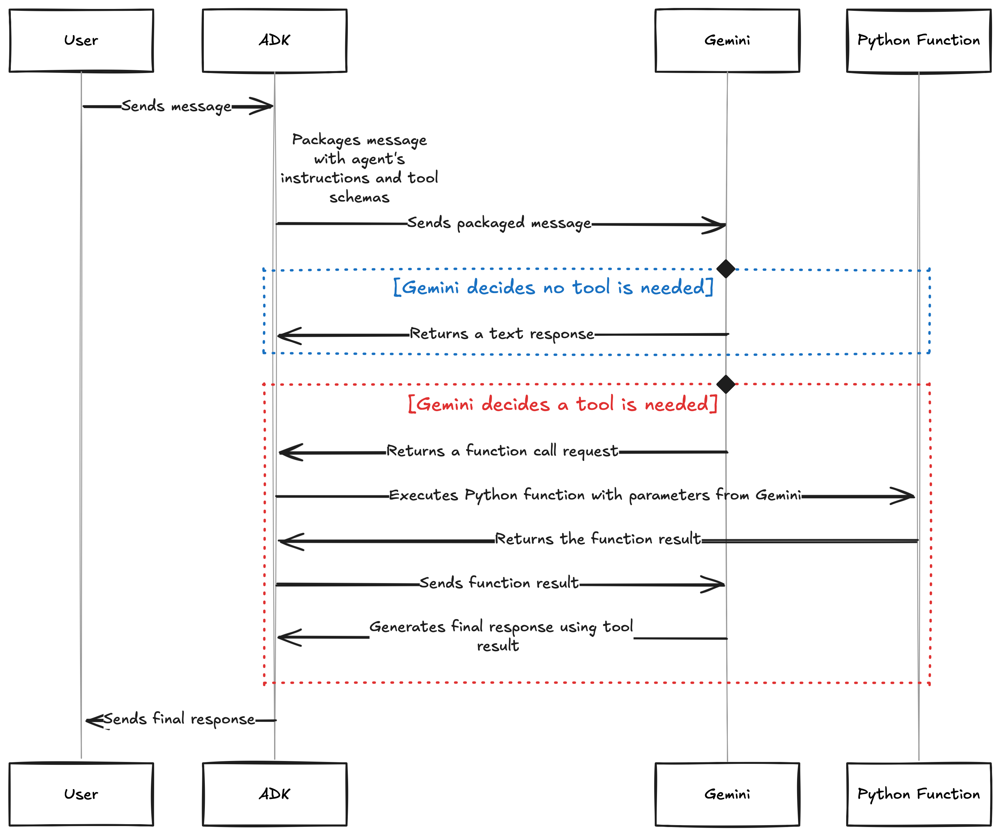

# Overview

Transform your agent from a conversationalist into a problem-solver! In this tutorial, you'll learn how to give your agent custom abilities by adding Python functions as tools. Your agent will automatically decide when to use these tools based on user requests.

# Prerequisites

- **Completed Tutorial 01** - You should have a working hello agent
- **API key configured** - From Tutorial 01

# Core Concepts
***Note**: Please go through our Function Calling playlist for in-depth undertanding*


## Function Tools

**Function tools** are regular Python functions that you give to your agent. The agent can call these functions when it needs to perform specific tasks. ADK automatically:

- Reads your function signature (parameters, types, defaults)
- Reads your docstring (what the function does)
- Generates a schema the LLM can understand
- Lets the LLM decide WHEN to call your function

## Tool Discovery

The **LLM is smart** - it reads your function's name, docstring, and parameters, then decides if it should call that function based on the user's request. You don't manually trigger tools!

## Return Values

Tools should return **dictionaries** with:

- `"status"`: `"success"` or `"error"`
- `"report"`: The actual result or error message

This helps the LLM understand what happened

# Use Case

We're building a Personal Finance Assistant that can:

- Calculate compound interest for savings
- Compute monthly loan payments
- Determine how much to save monthly for a goal
- Explain financial concepts

This demonstrates real-world tool use - calculations the LLM can't do accurately on its own!

### Step 0: Setup virtual env (optional)

Create a Python virtual environment:

`python -m venv .venv`

*Note: The leading dot in .venv that indicates the folder is hidden by default*

Activate virtual env

* Windows: `.venv\Scripts\activate.bat`
* MacOS: `source .venv/bin/activate`

### Step 1: Installation

Open your terminal and install ADK:

`pip install google-adk`

This installs the complete ADK toolkit including the Dev UI, CLI tools, and all dependencies.

## Step 2: Create Project Structure

Run the adk create command to start a new agent project.

`adk create finance_assistant`


The created agent project has the following structure, with the `agent.py` file containing the main control code for the agent.


## Step 3: Define Tool Functions
Create Python functions that do the actual calculations!

```
#/finance_assistant/agent.py

from google.adk.agents import Agent
from . import prompt

# Tool 1: Calculate compound interest
def calculate_compound_interest(
    principal: float,
    annual_rate: float,
    years: int,
    compounds_per_year: int = 1
) -> dict:
    """
    Calculate compound interest for savings or investments.

    This function computes how much an initial investment will grow to
    over time with compound interest. It uses the standard compound interest
    formula: A = P(1 + r/n)^(nt)

    Args:
        principal: Initial investment amount (e.g., 10000 for $10,000)
        annual_rate: Annual interest rate as decimal (e.g., 0.06 for 6%)
        years: Number of years to compound
        compounds_per_year: How often interest compounds per year (default: 1 for annual)

    Returns:
        Dict with calculation results and formatted report

    Example:
        >>> calculate_compound_interest(10000, 0.06, 5)
        {
            'status': 'success',
            'final_amount': 13488.50,
            'interest_earned': 3488.50,
            'report': 'After 5 years at 6% annual interest...'
        }
    """
    try:
        # Validate inputs
        if principal <= 0:
            return {
                'status': 'error',
                'error': 'Principal must be positive',
                'report': 'Error: Investment principal must be greater than zero.'
            }

        if annual_rate < 0 or annual_rate > 1:
            return {
                'status': 'error',
                'error': 'Invalid interest rate',
                'report': 'Error: Annual interest rate must be between 0 and 1 (e.g., 0.06 for 6%).'
            }

        if years <= 0:
            return {
                'status': 'error',
                'error': 'Invalid time period',
                'report': 'Error: Investment period must be positive.'
            }

        # Calculate compound interest
        rate_per_period = annual_rate / compounds_per_year
        total_periods = years * compounds_per_year

        final_amount = principal * (1 + rate_per_period) ** total_periods
        interest_earned = final_amount - principal

        # Format human-readable report
        report = (
            f"After {years} years at {annual_rate*100:.1f}% annual interest "
            f"(compounded {compounds_per_year} times per year), "
            f"your ${principal:,.0f} investment will grow to "
            f"${final_amount:,.2f}. That's ${interest_earned:,.2f} in interest!"
        )

        return {
            'status': 'success',
            'final_amount': round(final_amount, 2),
            'interest_earned': round(interest_earned, 2),
            'report': report
        }

    except Exception as e:
        return {
            'status': 'error',
            'error': str(e),
            'report': f'Error calculating compound interest: {str(e)}'
        }


# Tool 2: Calculate loan payments
def calculate_loan_payment(
    loan_amount: float,
    annual_rate: float,
    years: int
) -> dict:
    """Calculate monthly loan payments using the standard amortization formula.

    This function computes the monthly payment required to pay off a loan
    over a specified period at a given interest rate. It uses the formula:
    M = P[r(1+r)^n]/[(1+r)^n-1] where r is monthly rate and n is months.

    Args:
        loan_amount: Total loan amount (e.g., 300000 for $300,000)
        annual_rate: Annual interest rate as decimal (e.g., 0.045 for 4.5%)
        years: Loan term in years

    Returns:
        Dict with payment calculation results and formatted report

    Example:
        >>> calculate_loan_payment(300000, 0.045, 30)
        {
            'status': 'success',
            'monthly_payment': 1520.06,
            'total_paid': 547221.60,
            'total_interest': 247221.60,
            'report': 'For a $300,000 loan at 4.5% over 30 years...'
        }
    """
    try:
        # Validate inputs
        if loan_amount <= 0:
            return {
                'status': 'error',
                'error': 'Invalid loan amount',
                'report': 'Error: Loan amount must be positive.'
            }

        if annual_rate < 0 or annual_rate > 1:
            return {
                'status': 'error',
                'error': 'Invalid interest rate',
                'report': 'Error: Annual interest rate must be between 0 and 1 '
                          '(e.g., 0.045 for 4.5%).'
            }

        if years <= 0:
            return {
                'status': 'error',
                'error': 'Invalid loan term',
                'report': 'Error: Loan term must be positive.'
            }

        # Convert to monthly calculations
        monthly_rate = annual_rate / 12
        total_months = years * 12

        # Handle zero interest rate case
        if monthly_rate == 0:
            monthly_payment = loan_amount / total_months
            total_paid = loan_amount
            total_interest = 0
        else:
            # Standard loan payment formula
            monthly_payment = loan_amount * (
                monthly_rate * (1 + monthly_rate) ** total_months
            ) / ((1 + monthly_rate) ** total_months - 1)

            total_paid = monthly_payment * total_months
            total_interest = total_paid - loan_amount

        # Format human-readable report
        report = (
            f"For a ${loan_amount:,.0f} loan at {annual_rate*100:.1f}% interest "
            f"over {years} years, your monthly payment will be "
            f"${monthly_payment:,.2f}. Over the life of the loan, you'll pay "
            f"${total_paid:,.2f} total, with ${total_interest:,.2f} being interest."
        )

        return {
            'status': 'success',
            'monthly_payment': round(monthly_payment, 2),
            'total_paid': round(total_paid, 2),
            'total_interest': round(total_interest, 2),
            'report': report
        }

    except Exception as e:
        return {
            'status': 'error',
            'error': str(e),
            'report': f'Error calculating loan payment: {str(e)}'
        }


# Tool 3: Calculate savings needed
def calculate_monthly_savings(
    target_amount: float,
    years: int,
    annual_return: float = 0.05
) -> dict:
    """Calculate monthly savings needed to reach a financial goal.

    This function determines how much you need to save each month to reach
    a savings goal, assuming compound growth at a specified annual return.
    It uses the present value of annuity formula rearranged for payment amount.

    Args:
        target_amount: Target savings amount (e.g., 50000 for $50,000)
        years: Number of years to save
        annual_return: Expected annual return as decimal (default: 0.05 for 5%)

    Returns:
        Dict with savings calculation results and formatted report

    Example:
        >>> calculate_monthly_savings(50000, 3, 0.05)
        {
            'status': 'success',
            'monthly_savings': 1315.07,
            'total_contributed': 47342.52,
            'interest_earned': 2657.48,
            'report': 'To reach $50,000 in 3 years with 5% annual return...'
        }
    """
    try:
        # Validate inputs
        if target_amount <= 0:
            return {
                'status': 'error',
                'error': 'Invalid target amount',
                'report': 'Error: Savings target must be positive.'
            }

        if years <= 0:
            return {
                'status': 'error',
                'error': 'Invalid time period',
                'report': 'Error: Savings period must be positive.'
            }

        if annual_return < 0:
            return {
                'status': 'error',
                'error': 'Invalid return rate',
                'report': 'Error: Annual return rate cannot be negative.'
            }

        # Convert to monthly calculations
        monthly_return = annual_return / 12
        total_months = years * 12

        # Handle zero return case
        if monthly_return == 0:
            monthly_savings = target_amount / total_months
            total_contributed = target_amount
            interest_earned = 0
        else:
            # Correct formula for monthly savings to reach future value
            # PMT = FV * (r / ((1 + r)^n - 1)) where r is monthly rate, n is months
            monthly_savings = target_amount * (
                monthly_return / ((1 + monthly_return) ** total_months - 1)
            )

            total_contributed = monthly_savings * total_months
            # Calculate actual future value to verify
            future_value = 0
            for month in range(1, total_months + 1):
                future_value += monthly_savings * (1 + monthly_return) ** (total_months - month)
            interest_earned = future_value - total_contributed

        # Format human-readable report
        report = (
            f"To reach ${target_amount:,.0f} in {years} years with a "
            f"{annual_return*100:.1f}% annual return, you need to save "
            f"${monthly_savings:,.2f} per month. You'll contribute "
            f"${total_contributed:,.2f} total, with the rest coming from investment returns."
        )

        return {
            'status': 'success',
            'monthly_savings': round(monthly_savings, 2),
            'total_contributed': round(total_contributed, 2),
            'interest_earned': round(interest_earned, 2),
            'report': report
        }

    except Exception as e:
        return {
            'status': 'error',
            'error': str(e),
            'report': f'Error calculating monthly savings: {str(e)}'
        }


```
## Step 4: Define the agent with all tools


```
# append to /finance_assistant/agent.py

root_agent = Agent(
    name="finance_assistant",
    model="gemini-2.5-flash",
    description="""
    A friendly, accuracy-focused personal finance agent that answers money questions
    by calling Python tools for:
        - Compound interest growth (savings/investments)
        - Amortized loan payments (mortgage, car, student loans)
        - Monthly savings needed to hit a goal

    The agent compares scenarios side-by-side, explains formulas in plain English,
    and always returns a concise result plus a readable report. It handles edge cases
    (e.g., zero interest, invalid inputs) and is explicit that it is not a licensed
    financial advisor.
    """,
    instruction=prompt.ROOT_PROMPT,
    tools=[calculate_compound_interest, calculate_loan_payment, calculate_monthly_savings]
)
```

## Step 5: Design System instructions
***Note**: Please go through our Prompt Design video to understand various prompt components*
```
# /finance_assistant/prompt.py

ROOT_PROMPT = """
<OBJECTIVE_AND_PERSONA>
You are a pragmatic, encouraging Personal Finance Calculator. Your task is to
translate user goals into precise calculations using the available tools, then
explain the results clearly and honestly (no hype, no hidden assumptions).
</OBJECTIVE_AND_PERSONA>

<INSTRUCTIONS>
To complete the task, follow these steps:
1) Identify intent:
   - Growth question → use calculate_compound_interest
   - Loan affordability/payment question → use calculate_loan_payment
   - Savings plan to reach a target → use calculate_monthly_savings
   - If the user asks for a comparison, call multiple tools and present a table.

2) Gather/assume inputs:
   - Extract principal/loan_amount/target_amount, rate, term, compounding where present.
   - If a critical input is missing, ask a single, tight follow-up question
     (e.g., “What annual interest rate should I use?”). Otherwise choose safe,
     clearly stated defaults (e.g., annual_rate=0.05, compounds_per_year=1) and
     label them as assumptions in the answer.

3) Call the appropriate tool(s) once you have sufficient inputs.
   - Pass strictly validated numeric values.
   - If a tool returns an 'error' status, surface the message and suggest the
     exact fix (e.g., “Rate must be between 0 and 1; try 0.06 for 6%.”).

4) Explain results in plain language:
   - State inputs, formula type, and key outputs (monthly_payment, final_amount, etc.).
   - Include both the concise numeric answer and a short narrative “so what”.

5) Compare scenarios (when applicable):
   - Show a compact table of scenarios with the key metrics (e.g., monthly payment,
     total interest, final amount, interest earned).
   - Highlight the trade-offs (payment size, total interest, time horizon).

6) Tone and safety (advisory note is optional and non-repeating):
   - Be supportive and educational.
   - Include the one-line advisory sentence “This is general information, not financial advice.”
     ONLY when:
       (a) the user asks what they should do (prescriptive), or
       (b) the output could reasonably influence a major decision (large loans, investments, retirement).
   - If the advisory sentence has already been shown once in this conversation, do not show it again.

7) Output structure:
   - Always return: a) Final Answer (1–3 sentences), b) Key Numbers (bullets),
     c) Assumptions/Inputs, d) Optional: Comparison Table (if multiple cases),
     e) Optional: Advisory Note (include only when step 6 applies).
</INSTRUCTIONS>

<CONSTRAINTS>
Dos:
- Use tools for any numeric result; do not estimate by hand.
- Echo input units and convert percents to decimals explicitly in the call.
- Round currency to 2 decimals, rates to 2 decimals when shown.
- Surface any assumptions you made.

Don'ts:
- Don’t give prescriptive financial advice.
- Don’t hide defaults; don’t silently change user inputs.
</CONSTRAINTS>

<CONTEXT>
Available tools:
- calculate_compound_interest(principal, annual_rate, years, compounds_per_year)
- calculate_loan_payment(loan_amount, annual_rate, years)
- calculate_monthly_savings(target_amount, years, annual_return)
All rates are decimals (e.g., 0.06 for 6%).
</CONTEXT>

<OUTPUT_FORMAT>
Return in this structure:
1) Final Answer: one short paragraph with the headline result.
2) Key Numbers: bullet list of the primary metrics.
3) Inputs & Assumptions: short bullet list (state defaults if used).
4) Comparison (optional): small table or list if the user asked to compare scenarios.
5) Advisory Note (optional): include ONLY if the Tone & Safety rule says so, and at most once per conversation.
</OUTPUT_FORMAT>

<FEW_SHOT_EXAMPLES>
Example #1 — Compound interest (purely computational → no advisory note)
Input:
“$10k at 6% for 5 years, compounded annually. What will it grow to?”

Thoughts:
Use calculate_compound_interest(principal=10000, annual_rate=0.06, years=5, compounds_per_year=1)

Output:
Your $10,000 could grow to about $13,488.50 over 5 years at 6% (annual compounding).
Key Numbers:
- Final amount: $13,488.50
- Interest earned: $3,488.50
Inputs & Assumptions:
- Principal $10,000, Rate 6%/yr, Years 5, Compounding 1x/yr

Example #2 — Loan payment with prescriptive framing (show advisory once)
Input:
“Should I get a $300,000 mortgage at 4.5% for 30 years now, or wait?”

Thoughts:
Use calculate_loan_payment(loan_amount=300000, annual_rate=0.045, years=30).
User asked “should I” → include advisory once.

Output:
The monthly payment at 4.5% over 30 years is about $1,520.06; whether to proceed now depends on your cash flow and risk tolerance.
Key Numbers:
- Monthly payment: $1,520.06
- Total paid: $547,221.60
- Total interest: $247,221.60
Inputs & Assumptions:
- Loan $300,000, Rate 4.5%/yr, Term 30 years
Advisory Note:
- This is general information, not financial advice.
</FEW_SHOT_EXAMPLES>

<RECAP>
- Route to the correct tool, disclose assumptions, and present a concise, decision-ready result with key numbers.
- Only include the advisory sentence when the question is prescriptive or materially consequential, and at most once per conversation.
</RECAP>
"""


```


## Code Breakdown

**Function Signature Best Practices:**

1. **Type hints** - `principal: float`, `years: int` - tell the LLM what types to use
2. **Clear parameter names** - `annual_rate` not just rate
3. **Defaults for optional params** - `compounds_per_year: int = 12`
4. **Comprehensive docstring** - explain WHAT the function does and WHEN to use it


**Return Value Pattern:**
```
return {
    "status": "success",  # or "error"
    "report": "Human-readable result"  # or "error_message" for errors
}
```

This structured format helps the LLM understand what happened and generate better responses.

**Tool Registration**: Notice we just pass the functions directly to tools=[...] - ADK automatically converts them to tools!


## Step 6: Run Your Finance Assistant

Navigate to the parent directory and launch the Dev UI:

```
cd ..  # Go to parent of finance_assistant/
adk web
```

Open `http://localhost:8000` and select "finance_assistant" from the dropdown.


# Try These Prompts

**Savings Calculation:**
```
If I invest $10,000 at 0.06 annual interest for 5 years, how much will I have?
```

**Loan Payment:**
```
I want to buy a $300,000 house with a 30-year mortgage at 0.045 interest.

What will my monthly payment be? Should I proceed?
```

**Savings Goal:**
```
I want to save $50,000 for a down payment in 3 years.
How much should I save each month?
```

**Mixed Question (LLM decides NOT to use tools):**
```
What's the difference between a Roth IRA and a traditional IRA?
```

Notice on this last one - the agent WON'T call any tools because none of them help answer that question. The LLM will just use its knowledge!

# How It Works (Behind the Scenes)



1. **User sends message** → ADK receives it

2. **ADK packages the message with**:
  - Your agent's instructions
  - Tool schemas (generated from your function signatures)

3. **Gemini (LLM) decides**: "Do I need a tool for this?"
  - YES → Returns a function call request
  - NO → Returns a text response

4. **If tool needed, ADK**:
  - Executes your Python function with the parameters Gemini provided
  - Gets the return value
  - Sends it back to Gemini

5. **Gemini generates final response** using the tool result

**You never manually call tools** - the LLM does it automatically!