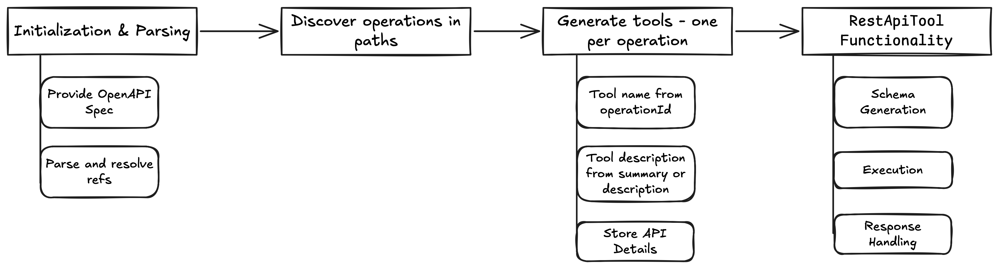

# Overview

Learn how to automatically generate tools from OpenAPI specifications, enabling your agent to interact with REST APIs without writing tool functions manually.

# Prerequisites

- Python 3.9+
- Google API key
- Completed Tutorials 01-02

# Core Concepts

## What is OpenAPI?

*   OpenAPI is a machine-readable and human-readable specification and standard for describing REST APIs
*   It defines the entire API's structure and functionality

***Note**: Please check [`example_todo_openapi.yaml`](../example_todo_openapi.yaml) for a sample OpenAPI specification*. Verify spec at https://editor.swagger.io/

## Why it matters?

- ADK can automatically turn an OpenAPI file into callable tools your agent can use — eliminates the need to manually define individual function tools for each API endpoint

- Use `OpenAPIToolset` to instantly create agent tools (`RestApiTool`) from your existing API documentation (OpenAPI spec), enabling agents to seamlessly call your web services.

## Key Components

- **OpenAPIToolset**: Primary class - initialize it with your OpenAPI specification, and it handles the parsing and generation of tools.

- **RestApiTool**:
  - This class represents a single, callable API operation (like `GET` or `POST` )
  - `OpenAPIToolset` creates one `RestApiTool` instance for **each operation** defined in your spec.


## How it works?


# Use Case: Chuck Norris Fact Assistant
## Introduction

### Who is Chuck Norris (in pop culture)?

Chuck Norris is an American martial artist and actor (best known for Walker, Texas Ranger). On the internet, he’s famous for funny “Chuck Norris facts” — short jokes that exaggerate his toughness and abilities.

### What You'll Build
We will build an agent that retrieves Chuck Norris jokes/facts from the public [Chuck Norris *API*](https://api.chucknorris.io/)

- Searches for Chuck Norris jokes by category
- Gets random jokes
- Lists available categories
- Uses `OpenAPIToolset` to auto-generate tools from API specification

### Why This API?

- ✅ Free, no API key required
- ✅ Simple OpenAPI specification
- ✅ Great for learning

API: https://api.chucknorris.io/

## Step 0: Setup virtual env (optional)

Create a Python virtual environment:

`python -m venv .venv`

*Note: The leading dot in .venv that indicates the folder is hidden by default*

Activate virtual env

* Windows: `.venv\Scripts\activate.bat`
* MacOS: `source .venv/bin/activate`

## Step 1: Installation

Open your terminal and install ADK:

`pip install google-adk`

This installs the complete ADK toolkit including the Dev UI, CLI tools, and all dependencies.

## Step 2: Create Project Structure

Run the adk create command to start a new agent project.

`adk create chuck_norris_agent`


The created agent project has the following structure, with the `agent.py` file containing the main control code for the agent.

## Step 3: OpenAPI specification
- The Chuck Norris API doesn’t publish an official OpenAPI file. We took the help of ChatGPT to create one.
- Many APIs publish an OpenAPI/Swagger file in their docs or GitHub

```
from google.adk.agents import Agent
from google.adk.tools.openapi_tool import OpenAPIToolset

# Chuck Norris API OpenAPI Specification
# Based on: https://api.chucknorris.io/
CHUCK_NORRIS_SPEC = {
    "openapi": "3.0.0",
    "info": {
        "title": "Chuck Norris API",
        "description": "Free JSON API for hand curated Chuck Norris facts",
        "version": "1.0.0"
    },
    "servers": [
        {
            "url": "https://api.chucknorris.io/jokes"
        }
    ],
    "paths": {
        "/random": {
            "get": {
                "operationId": "get_random_joke",
                "summary": "Get a random Chuck Norris joke",
                "description": "Retrieve a random joke from the database. Can optionally filter by category.",
                "parameters": [
                    {
                        "name": "category",
                        "in": "query",
                        "description": "Filter jokes by category (optional)",
                        "required": False,
                        "schema": {
                            "type": "string"
                        }
                    }
                ],
                "responses": {
                    "200": {
                        "description": "Successful response",
                        "content": {
                            "application/json": {
                                "schema": {
                                    "type": "object",
                                    "properties": {
                                        "icon_url": {"type": "string"},
                                        "id": {"type": "string"},
                                        "url": {"type": "string"},
                                        "value": {"type": "string"}
                                    }
                                }
                            }
                        }
                    }
                }
            }
        },
        "/search": {
            "get": {
                "operationId": "search_jokes",
                "summary": "Search for jokes",
                "description": "Free text search for jokes containing the query term.",
                "parameters": [
                    {
                        "name": "query",
                        "in": "query",
                        "description": "Search query (3+ characters required)",
                        "required": True,
                        "schema": {
                            "type": "string",
                            "minLength": 3
                        }
                    }
                ],
                "responses": {
                    "200": {
                        "description": "Successful response",
                        "content": {
                            "application/json": {
                                "schema": {
                                    "type": "object",
                                    "properties": {
                                        "total": {"type": "integer"},
                                        "result": {
                                            "type": "array",
                                            "items": {
                                                "type": "object",
                                                "properties": {
                                                    "icon_url": {"type": "string"},
                                                    "id": {"type": "string"},
                                                    "url": {"type": "string"},
                                                    "value": {"type": "string"}
                                                }
                                            }
                                        }
                                    }
                                }
                            }
                        }
                    }
                }
            }
        },
        "/categories": {
            "get": {
                "operationId": "get_categories",
                "summary": "Get all joke categories",
                "description": "Retrieve list of available joke categories.",
                "responses": {
                    "200": {
                        "description": "Successful response",
                        "content": {
                            "application/json": {
                                "schema": {
                                    "type": "array",
                                    "items": {
                                        "type": "string"
                                    }
                                }
                            }
                        }
                    }
                }
            }
        }
    }
}
```
## Step 4: Create OpenAPIToolset from specification
ADK will automatically generate 3 tools:
  - get_random_joke(category: Optional[str])
  - search_jokes(query: str)
  - get_categories()

```
chuck_norris_toolset = OpenAPIToolset(spec_dict=CHUCK_NORRIS_SPEC)
```

## Step 5: Agent Definition

```
root_agent = Agent(
    name="chuck_norris_agent",
    model="gemini-2.5-flash",

    description="""
    Chuck Norris fact assistant that can retrieve jokes/facts from the
    Chuck Norris API using OpenAPI tools.
    """,

    instruction="""
    You are a fun Chuck Norris fact assistant!

    CAPABILITIES:
    - Get random Chuck Norris jokes (optionally filtered by category)
    - Search for jokes containing specific keywords
    - List all available joke categories

    STYLE:
    - Be enthusiastic and playful
    - Chuck Norris jokes are exaggerated for comedic effect
    - Format jokes clearly for easy reading
    - If search returns multiple results, show a few best ones

    WORKFLOW:
    - For random requests → use get_random_joke
    - For specific topics → use search_jokes with query
    - To see categories → use get_categories
    - For category-specific random → use get_random_joke with category parameter

    IMPORTANT:
    - Always extract the 'value' field from API response (that's the actual joke)
    - If search finds 0 results, suggest trying a different keyword
    - Categories are lowercase (e.g., "dev", "movie", "food")
    """,

    # Pass the toolset to the agent
    tools=[chuck_norris_toolset]
)
```
# Try These Prompts

## Example 1: Random Joke

**User**: "Tell me a random Chuck Norris joke"

**Agent Process**:

1. Calls `get_random_joke()` tool (no category)
2. API returns JSON with 'value' field
3. Agent extracts and formats joke

## Example 2: Search by Keyword

**User**: "Find jokes about programming"

**Agent Process**:

1. Calls `search_jokes(query="programming")` tool
2. API returns array of matching jokes
3. Agent selects best ones and formats

## Example 3: List Categories

**User**: "What categories are available?"

**Agent Process**:

1. Calls `get_categories()` tool
2. API returns array of category strings
3. Agent formats list

## Example 4: Category-Specific Random

**User**: "Tell me a joke from the dev category"

**Agent Process**:

1. Calls `get_random_joke(category="dev")` tool
2. API returns random joke from 'dev' category
3. Agent formats joke

# Key Takeaways

- **OpenAPIToolset** **= Zero Manual Tool Code**: No need to write def `search_jokes()` yourself
- **operationId** **→ Function Name**: Controls how LLM sees the tool
- **parameters** **→ Function Args**: Becomes tool function signature
- **Works with Any OpenAPI API**: GitHub, Stripe, Twilio, custom APIs