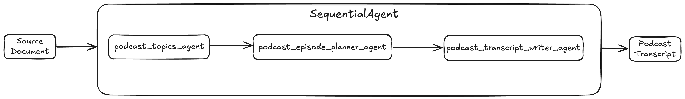
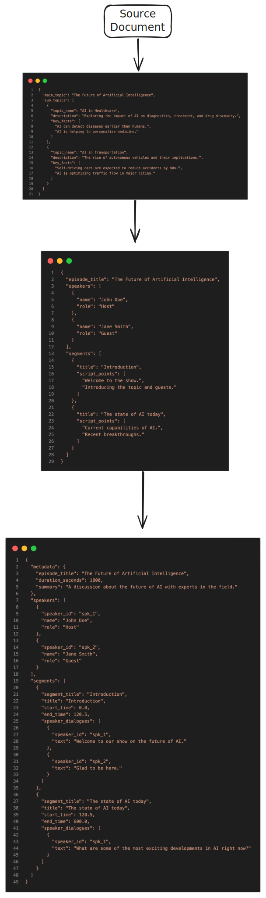

# Tutorial 04: Sequential Workflows - Build Agent Pipelines

## Overview
Connect your multiple agents to create sophisticated multi-step workflow! Learn how to chain multiple agents in a strict sequence where each agent's output feeds into the next - perfect for content creation, data processing, or quality control pipelines.

**Use Case** - We will be a **Podcast Transcript Agent** that automates the creation of podcast transcripts from any PDF, Markdown, or Text document. 

## Prerequisites
- **Completed Tutorials 01-03** - Understanding of agents, tools, and OpenAPI
- **Python 3.13** or higher
- **API key configured** - From Tutorial 01

## Core Concepts
### Workflow Agents
- **Specialized agents** that control the execution flow of its sub-agents.
- Purely for **orchestration** and based on predefined logic
- They **do not call an LLM** for the orchestration
- **Deterministic and predictable** execution patterns

**ADK provides three core workflow agent types**
- `SequentialAgent` – runs sub-agents one after another
- `LoopAgent` – runs sub-agents repeatedly until a stop condition is met
- `ParallelAgent` – runs multiple sub-agents at the same time

We’re going to focus on the `SequentialAgent`.

### Data Flow with output_key
Agents pass data to each other using **session state**:

- Agent defines `output_key="my_result"`
- ADK automatically saves agent's response to `state['my_result']`
- Next agent reads it using `{my_result}` in its **instruction**

## Use Case
We're building a **Podcast Transcript Generator Pipeline** with 3 stages:
- **Topic Extractor Agent** – Reads the source document and pulls out the key themes and talking points
- **Episode Planner Agent** – Turns those topics into a structured episode outline with segments and flow
- **Script Writer Agent** – Uses the outline to generate a natural, conversational podcast transcript between hosts

### Agent Architecture


# Project Structure
```
.
├── docs
├── images
├── podcast_transcript_agent
│   ├── agent.py
│   ├── __init__.py
│   ├── models
│   │   ├── podcast_plan.py
│   │   ├── podcast_topics.py
│   │   └── podcast_transcript.py
│   └── sub_agents
│       ├── podcast_episode_planner
│       │   ├── agent.py
│       │   ├── __init__.py
│       │   └── prompt.py
│       ├── podcast_topics
│       │   ├── agent.py
│       │   ├── __init__.py
│       │   └── prompt.py
│       └── podcast_transcript_writer
│           ├── agent.py
│           ├── __init__.py
│           └── prompt.py
├── .env
├── .gitignore
├── .python-version
├── pyproject.toml
└── uv.lock
```

### Setup
0. Include `.env` file with Google API key
1. Create and activate virtual environment
    ```
    python3 -m venv .venv
    source .venv/bin/activate
    ```
2. Install `uv`
    ```
    pip install uv
    ```
3. Init project
    ```
    uv init
    ```
4. Add `google-adk`
    ```
    uv add google-adk
    ```
5. Create directory structure
```
# Create the project directory
mkdir -p podcast_transcript_agent/models
mkdir -p podcast_transcript_agent/sub_agents/podcast_episode_planner
mkdir -p podcast_transcript_agent/sub_agents/podcast_topics
mkdir -p podcast_transcript_agent/sub_agents/podcast_transcript_writer
touch podcast_transcript_agent/agent.py
touch podcast_transcript_agent/__init__.py
touch podcast_transcript_agent/models/podcast_plan.py
touch podcast_transcript_agent/models/podcast_topics.py
touch podcast_transcript_agent/models/podcast_transcript.py
touch podcast_transcript_agent/sub_agents/podcast_episode_planner/agent.py
touch podcast_transcript_agent/sub_agents/podcast_episode_planner/__init__.py
touch podcast_transcript_agent/sub_agents/podcast_episode_planner/prompt.py
touch podcast_transcript_agent/sub_agents/podcast_topics/agent.py
touch podcast_transcript_agent/sub_agents/podcast_topics/__init__.py
touch podcast_transcript_agent/sub_agents/podcast_topics/prompt.py
touch podcast_transcript_agent/sub_agents/podcast_transcript_writer/agent.py
touch podcast_transcript_agent/sub_agents/podcast_transcript_writer/__init__.py
touch podcast_transcript_agent/sub_agents/podcast_transcript_writer/prompt.py
```

### Data flow (sample)


