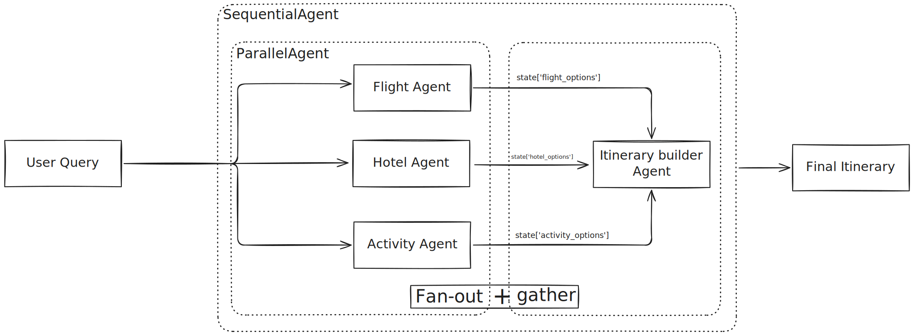

# Tutorial 05: Parallel Processing - Run Multiple Agents Simultaneously
Learn how to execute multiple agents concurrently to dramatically speed up your workflows! This tutorial covers the `ParallelAgent` pattern and the powerful **fan-out/gather** technique - essential for any real-world agent system that needs performance.

## Prerequisites
- **Completed Tutorials 01-04** - Understanding of agents, tools, and sequential workflows
- **Python 3.13** or higher
- **API key configured** - From Tutorial 01

## Core Concepts
The `ParallelAgent` executes multiple sub-agents concurrently (at the same time), not sequentially. This is perfect when:

- Tasks are independent (don't depend on each other)
- You want speed (faster than running one-by-one)
- You're gathering information from multiple sources

### Key Characteristics:

- All sub-agents start at the same time
- Agents run independently (no shared data during execution)
- ParallelAgent waits for ALL to complete
- Returns when the slowest agent finishes

## Use Case
We're building a **Smart Travel Planner** that helps users plan trips by:

- Searching flights (concurrent)
- Searching hotels (concurrent)
- Finding activities (concurrent)
- Merging everything into a complete itinerary (sequential)




This demonstrates the  [Parallel Fan-Out/Gather Pattern](https://google.github.io/adk-docs/agents/multi-agents/#parallel-fan-outgather-pattern) - parallel data gathering + sequential synthesis!

[Please note that the flight, hotel, and activity suggestions are generated based on the model's training data, not from live APIs.]

### Setup
0. Include `.env` file with Google API key
1. Create and activate virtual environment
    ```
    python3 -m venv .venv
    source .venv/bin/activate
    ```
2. Install `uv`
    ```
    pip install uv
    ```
3. Install the package and dependencies.
    ```
    uv sync
    ```
4. Running the Agent
    ```
    adk web
    ```
    Select "travel_planner_agent" in the top-left drop-down menu

### Sample Prompt
```
I want to plan a 3-day trip to Paris.
* For flights, I'll be flying from New York City, departing on October 15th.
* For hotels, my trip dates are from October 15th to October 18th. My budget is around $200-$250 per night. I'm looking for a hotel that ideally includes breakfast and has free Wi-Fi.
* For activities, I'm a first-time visitor traveling on a moderate budget and enjoy walking.
```

### Disclaimer
It is important to note that the flight, hotel, and activity suggestions provided by this agent are generated by the underlying language model based on its training data. In a real-world application, this information would be sourced from live APIs to ensure the data is current and accurate.

### Real-World Applications
Parallel Execution Is Perfect For:

- **Data Gathering**: Search multiple APIs/databases simultaneously
- **Content Creation**: Generate multiple variations concurrently
- **Analysis**: Run different analyses on same data in parallel
- **Validation**: Check multiple conditions simultaneously
- **Multi-Source Research**: Academic, news, social media, patents
- **Comparison Shopping**: Prices, reviews, availability from different sources