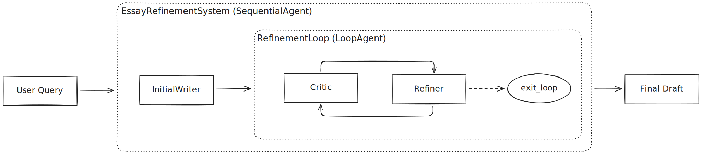

# Tutorial 06: Loop Agents - Iterative Refinement with Critic/Refiner Patterns

## Overview
Learn how to build self-improving agent systems using `LoopAgent`! This tutorial teaches you iterative refinement patterns - perfect for when quality matters more than speed. Build agents that critique their own work and keep improving until it's excellent.

## Prerequisites
- **Completed Tutorials 01-05** - Understanding of agents and workflows
- **Python 3.13** or higher
- **API key configured** - From Tutorial 01

## Core Concepts
### LoopAgent
The `LoopAgent` executes sub-agents **iteratively** (in a loop) for refinement and quality improvement. Unlike Sequential (runs once) or Parallel (runs concurrently), Loop runs the same agents **multiple times** until quality is sufficient or a limit is reached.

#### Key Characteristics:

- Executes sub-agents repeatedly in a loop
- Deterministic (not LLM-powered - just loop logic)
- MUST have termination conditions (prevent infinite loops!)

### The Critic → Refiner Pattern
The most common and powerful loop pattern
```
1. Critic: Evaluates current quality
2. Refiner: Improves based on critique
3. REPEAT until quality sufficient or max iterations
```
**Termination Strategy** : Use **exit tool** for early termination and `max_iterations` as safety. **Critic approves** and **refiner calls exit tool** to terminate the execution.

### When to Use Loop Agents
Use LoopAgent when:

- ✅ Quality improvement through iteration
- ✅ Self-correcting systems (write → review → fix → repeat)
- ✅ Retry logic with validation
- ✅ Gradual refinement (each iteration improves)

Don't use when:
- ❌ Single pass is sufficient
- ❌ No clear improvement metric
- ❌ Speed is more important than quality

## Use Case
We're building an **Essay Refinement System** that:

1. **Initial Writer** - Creates first draft (runs once)
2. **Refinement Loop** - Repeats until essay is excellent:
    - Critic: Evaluates essay quality, gives specific feedback
    - Refiner: Applies improvements OR signals completion



This demonstrates the [critic → refiner](https://google.github.io/adk-docs/agents/multi-agents/#iterative-refinement-pattern) loop pattern!

### Key Patterns:

1. State Overwriting: `refiner` uses same `output_key` as `initial_writer`
    - Each iteration overwrites the essay with improved version
    - Critic always evaluates the LATEST version

2. Exit Tool Pattern:
    - Critic outputs special phrase "APPROVED..."
    - Refiner detects phrase and calls `exit_loop()`
    - `tool_context.actions.escalate = True` signals stop

3. Safety Net: `max_iterations=5` prevents infinite loop if approval never comes

### Setup
0. Include `.env` file with Google API key
1. Create and activate virtual environment
    ```
    python3 -m venv .venv
    source .venv/bin/activate
    ```
2. Install `uv`
    ```
    pip install uv
    ```
3. Install the package and dependencies.
    ```
    uv sync
    ```
4. Running the Agent
    ```
    adk web
    ```
    Select "essay_refiner" in the top-left drop-down menu


## Real-World Applications
Loop Agents Are Perfect For:
- **Content Refinement**: Essays, articles, code, documentation
- **Quality Assurance**: Test generation, bug fixing, validation
- **Creative Iteration**: Image generation, music composition, design
- **Self-Correction**: Math problems, logical reasoning, planning
- **Retry Logic**: API calls with validation, data processing with error checking
- **Consensus Building**: Multi-reviewer approval systems

