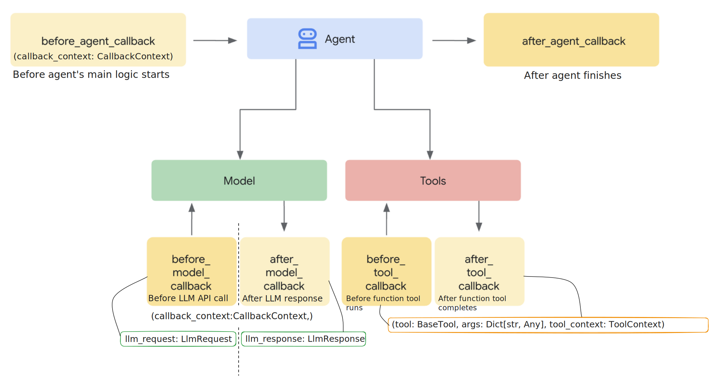

# Tutorial 07: Callbacks - Control Flow and Monitoring

## Overview
Learn how to use **callbacks** to observe, customize, and control agent behavior at specific/predefined points in the agent's execution process. This tutorial demonstrates a content moderation system with safety guardrails, logging, and request/response modification.

**Why It Matters**: Production agents need safety checks, monitoring, and control mechanisms. Callbacks provide these  without modifying the core ADK framework code.

## Prerequisites
- **Completed Tutorials 01-06** - Understanding of agents and workflows
- **Python 3.13** or higher
- **API key configured** - From Tutorial 01

## Core Concepts
### What are Callbacks?
Callbacks are functions you define that ADK automatically calls at specific execution points. They enable:

- **Monitor and Log**: Track agent activity and performance metrics
- **Filter Content**: Block inappropriate requests or responses
- **Transform Data**: Modify inputs and outputs in the agent workflow
- **Guardrails**: Enforcing safety policies
- **Add Custom Logic**: Insert business-specific processing into the agent flow

### Callback Types
Each type of callback provides access to specific **context objects** that contain valuable information about the current execution state.


#### Agent Lifecycle :

- `before_agent_callback(callback_context: CallbackContext)`: Before agent's main logic starts
- `after_agent_callback(callback_context: CallbackContext)`: After agent finishes

#### LLM Interaction :

- `before_model_callback(callback_context: CallbackContext, llm_request: LlmRequest)`: Before LLM API call
- `after_model_callback(callback_context: CallbackContext, llm_response: LlmResponse)`: After LLM response received

#### Tool Execution :

- `before_tool_callback(tool: BaseTool, args: Dict[str, Any], tool_context: ToolContext)`: Before tool function runs
- `after_tool_callback(tool: BaseTool, args: Dict[str, Any], tool_context: ToolContext)`: After tool function completes

## Control Flow Pattern
**Return `None`** → Proceed normally (allow default behavior)

**Return Object** → Override/skip operation:

- `before_agent_callback` → `Content`: Skip agent execution
- `before_model_callback` → `LlmResponse`: Skip LLM call, use returned response
- `before_tool_callback` → `dict`: Skip tool execution, use returned result
- `after_agent_callback` → `Content`: Replace agent output
- `after_model_callback` → `LlmResponse`: Replace LLM response
- `after_tool_callback` → `dict`: Replace tool result

## Callback Parameters and Context
### CallbackContext

The `CallbackContext` object is provided to all callback types and contains:

- **`agent_name`**: The name of the agent being executed
- **`invocation_id`**: A unique identifier for the current agent invocation
- **`state`**: Access to the session state, allowing you to read/write persistent data
- **`app_name`**: The name of the application
- **`user_id`**: The ID of the current user
- **`session_id`**: The ID of the current session


### ToolContext (for Tool Callbacks)

The `ToolContext` object is provided to tool callbacks and contains:

- **`agent_name`**: The name of the agent that initiated the tool call
- **`state`**: Access to the session state, allowing tools to read/modify shared data
- **`properties`**: Additional properties specific to the tool execution


### LlmRequest (for Model Callbacks)

The `LlmRequest` object is provided to the `before_model_callback` and contains:

- **`contents`**: List of Content objects representing the conversation history
- **`generation_config`**: Configuration for the model generation
- **`safety_settings`**: Safety settings for the model
- **`tools`**: Tools provided to the model


### LlmResponse (for Model Callbacks)

The `LlmResponse` object is returned from the model and provided to the `after_model_callback`:

- **`content`**: Content object containing the model's response
- **`tool_calls`**: Any tool calls the model wants to make
- **`usage_metadata`**: Metadata about the model usage (tokens, etc.)

## Use Case: Content Moderation Assistant
**Scenario**: Build a writing assistant that:

- Blocks requests with profanity or hate speech
- Validates tool arguments (e.g., no negative word counts)
- Logs all LLM calls for audit trail
- Adds safety instructions to every LLM request
- Filters PII (personally identifiable info) from responses
- Tracks usage metrics (LLM calls, tool uses, blocked requests)

### Setup
0. Include `.env` file with Google API key
1. Create and activate virtual environment
    ```
    python3 -m venv .venv
    source .venv/bin/activate
    ```
2. Install `uv`
    ```
    pip install uv
    ```
3. Install the package and dependencies.
    ```
    uv sync
    ```
4. Running the Agent
    ```
    uv run adk web
    ```
    Select "content_moderator_agent" in the top-left drop-down menu

## Sample User Queries
1. `Create a sample customer support interaction in 300 words that includes contact (email, phone number) and verification information` - query will trigger `after_model_callback` and mask PII information
2. `Create a 10000-word article on the history of Python` - query will trigger the validation logic in the `before_tool_callback`
3. `Write about profanity1 and hate-speech` - query will be blocked by the `before_model_callback` because it contains words from the `BLOCKED_WORDS` list
4. `Show me my usage statistics`- This will call the `get_usage_stats tool`, which will return the values of the counters that were incremented by the various callbacks (recorded across sessions for the same user - we will cover state management in the upcoming videos)