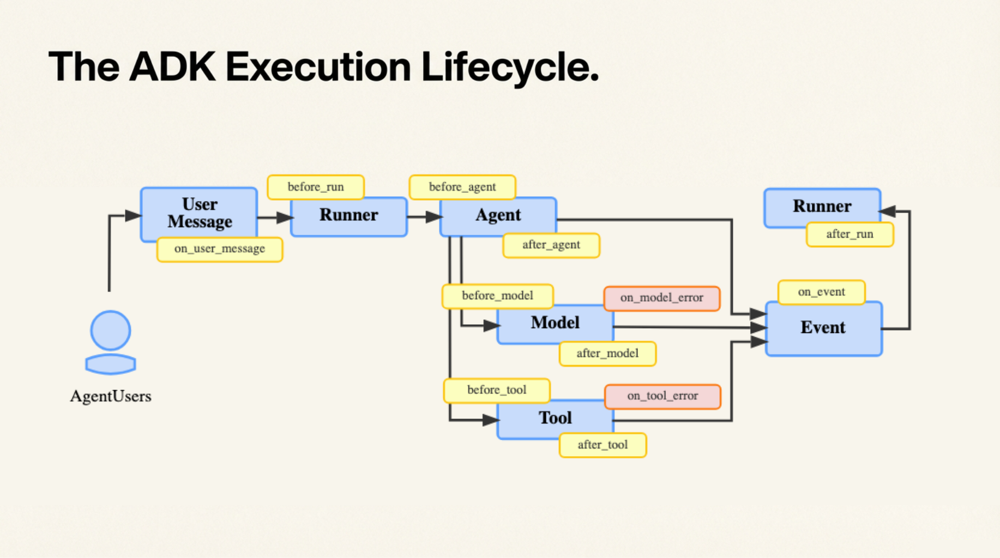

# Tutorial 13: ADK Plugins - Logging, Guardrails, and Global Runtime Control

## Overview



In this tutorial, we build a simple customer support agent and attach two plugins to the runner:

- ADK's built-in `LoggingPlugin` shows what is happening during execution
- `RefundGuardrailPlugin` blocks large refunds unless manager mode is enabled

This tutorial is terminal-first because ADK plugins are not supported in the ADK web interface.


## Why Plugins Matter
Plugins are useful when you want behavior that applies across the whole runtime, such as:

- audit logging
- business rule enforcement
- retry logic
- cost/latency monitoring
- output filtering


## Demo App
The example agent is a support operations assistant with two tools:

- `lookup_order_status(order_id)` for normal order lookups
- `refund_order(order_id, amount, reason)` for more sensitive refund actions

Together, these plugins show how logging and guardrails work at the runtime level:

- every request produces clear runtime logs
- refunds above a threshold are blocked unless manager mode is enabled

## Prerequisites
- Familiarity with ADK callbacks from Tutorial 07, since this tutorial builds on the same core idea of intercepting agent execution
- Python 3.13+
- A Google API key saved in `.env`

## Setup
From `tutorials/google-adk/13_adk_plugins`:

```bash
uv sync
```

## Run The Demo
Start the interactive terminal demo:

```bash
uv run python main.py
```

Once it starts, type prompts directly in the terminal. For example:

- `What is the status of order ORD-1001?`
- `Refund 25 dollars for order ORD-1001 because the shipment arrived late.`
- `Refund 500 dollars for order ORD-1001 because the shipment arrived damaged.`

Type `exit` or `quit` to stop the interactive session.

## Run A Single Prompt
If you want to test just one prompt instead of entering interactive mode:

```bash
uv run python main.py --prompt "What is the status of order ORD-1001?"
```

## Manager Mode Demo
To allow the large refund, run the same request with manager mode enabled:

```bash
uv run python main.py --manager-mode --prompt "Refund 500 dollars for order ORD-1001 because the shipment arrived damaged."
```

## What To Watch For
- the built-in `LoggingPlugin` prints runner, model, and tool activity
- `RefundGuardrailPlugin` intercepts refund tool calls before the tool runs
- the same refund request behaves differently depending on runtime policy

## Files
- `main.py` - terminal entrypoint for the demo
- `support_ops_agent/agent.py` - root ADK agent
- `support_ops_agent/tools.py` - mock support tools
- `support_ops_agent/plugins.py` - custom refund guardrail plugin

## Key Takeaways
- Plugins are a good fit for runtime-wide concerns
- Guardrails do not need to live inside every tool

